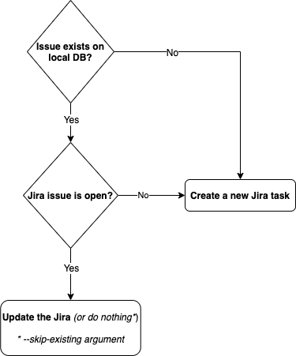

# jTrack


> A lightweight Python utility to allow fast and effective integrations of external reporters (e.g. automated scanners)
> with Jira.

---

## Description
You are using an automated scanner or QA tool and want it to automatically create/update Jira tickets for your teams?

But.. How can my scanner know if the Jira has been already created on a previous scan?
This is where jTrack comes in.

jTrack uses a local Sqlite to track the issues that have already been created and then updates the issues OR creates new one if the previous has already been resolved.

---

## The logic in a nutshell


---

## Installation
### Prerequisites
- Export the Jira details
  ```bash
  export JIRA_URL="https://JIRAURL"
  export JIRA_USER="JIRA_USER"
  export JIRA_PASSWORD="JIRA_PASSWORD"
  ```

### PIP (recommended)
```bash
pip install jtrack
```

### Manual
```bash
git clone https://github.com/rotemreiss/jTrack.git
cd jTrack
pip install .
```


---

## Recommended Python Version
jTrack was developed and tested only with __Python3__.

---

## Usage

Short Form    | Long Form            | Description
------------- | -------------------- |-------------
-h            | --help               | Show this help message and exit
-p            | --project            | The project's name on Jira (e.g. EXAMPLE).
-i            | --identifier         | A system identifier for the issue (unique key).
-s            | --summary            | Value for the summary field.
-d            | --description        | Value for the description field.
-pr           | --priority           | Value for the priority field.
-a            | --attachment         | One or more file paths seperated by comma to be attached
-l            | --labels             | Jira labels to add to new issues, separated by commas.
-j            | --jira-closed-status | Jira statuses that are considered to be closed, defaults to 'Closed' and 'Resolved', separated by commas. 
-t            | --jira-type          | Jira issue type for new tasks, deafults to 'Task'.
-se           | --skip-existing      | Do nothing if Jira already exists and open.
-q            | --quiet      | Do not print the banner.

### Examples
- List all options\
  ```jtrack --help```
- Handle new "event" with the identifier (unique key) *domain.com*\
  ```jtrack -p MY_PROJECT -i domain.com -s "This is the subject"```
- With Labels\
  ```jtrack -p MY_PROJECT -i domain.com -l SCAN-LABEL, DAILY-SCAN -s "This is the subject"```
- With attachment\
  ```jtrack -p MY_PROJECT -i domain.com -s "This is the subject" -a /tmp/scan-results.log```

### Real-life Examples
#### WordPress Scanner
You are running a daily security scan for vulnerabilities with a tool like [WPScan][wpscan] and you want to manage all
the results for that domain in one (up-to-date) Jira task:

Just pass the domain name as the identifier and the report file as an attachment.

**Take a look in the examples directory.** 

#### Subdomain Takeover Scanner
See https://github.com/rotemreiss/robusto/blob/master/hooks/_found_hook_jira_example

---
## Roadmap
- Extend the options (e.g. support other fields and custom fields)
- Update description or/and fields and not only attachments
- Generalize the decision and the action to support other actions (e.g. Slack and other ticketing systems)

---
## Contributing
Feel free to fork the repository and submit pull-requests.

---

## Support

[Create new GitHub issue][newissue]

Want to say thanks? :) Message me on <a href="https://www.linkedin.com/in/reissr" target="_blank">Linkedin</a>


---

## License

[](http://badges.mit-license.org)

- **[MIT license](http://opensource.org/licenses/mit-license.php)**

<!-- Markdown helper -->
[wpscan]: https://wpscan.org/
[newissue]: https://github.com/rotemreiss/jTrack/issues/new
